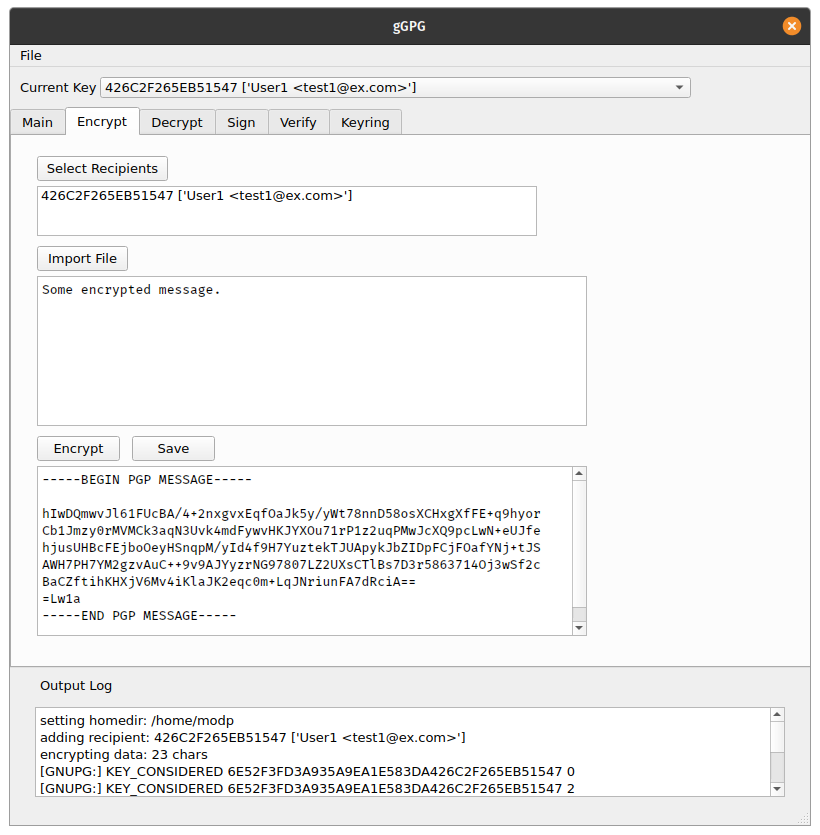
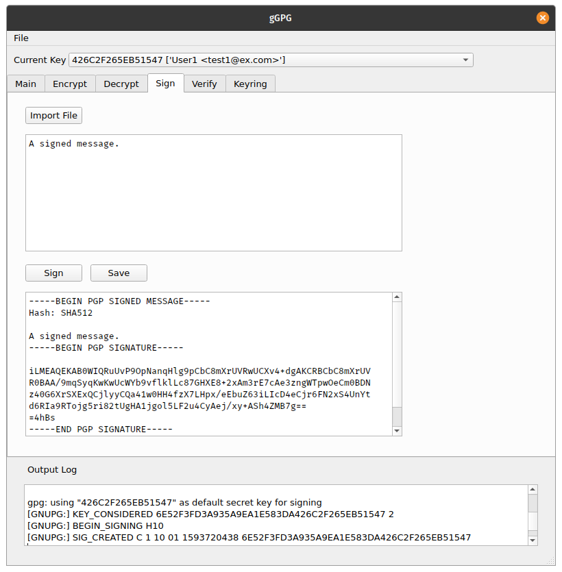
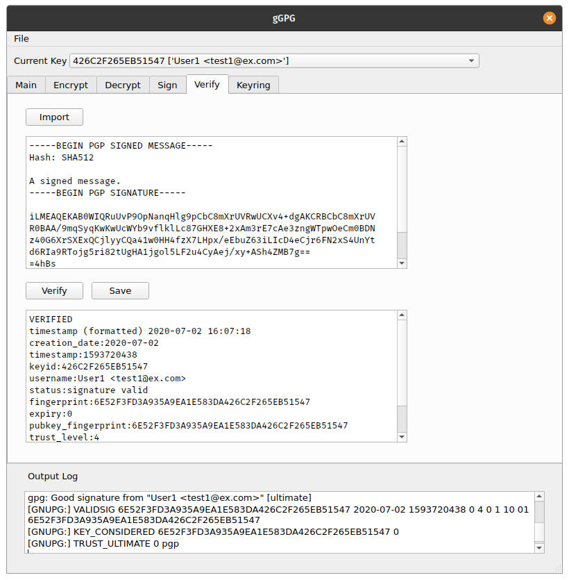

# gGPG
graphical GPG interface written in python. Simplified for lazy usability and minimal effort. 

Current features include:
* selecting keyrings
* importing public keys
* loading/saving text files 
* encrypting messages
  * choosing key
  * naming recipients
* decrypting messages
* signing messages
* verifying messages

Some things in the works:
* more gpg-related features
* creating/deleting keys
* address books
  * detailed key view
  * previous messages
  * signed message book
* improved log output

## Encrypting a message

## Signing a message

## Verifying a message

