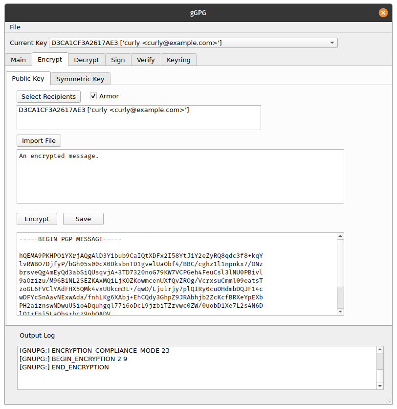

# gGPG
graphical GPG interface written in python. Simplified for lazy usability and minimal effort. 

More features keep on coming. 

Current features include:
* selecting keyrings
* importing public keys
* loading/saving text files
* asymmetric encryption
* symmetric encryption
* decrypting messages
* ascii-armored or binary output
* signing messages
* verifying messages

Some things in the works:
* more gpg-related features
* creating/deleting keys
* address books
  * detailed key view
  * previous messages
  * signed message book
* improved log output

## Asymmetric encryption

## Symmetric encryption

## Viewing/exporting keys

## Signing a message

## Verifying a message

